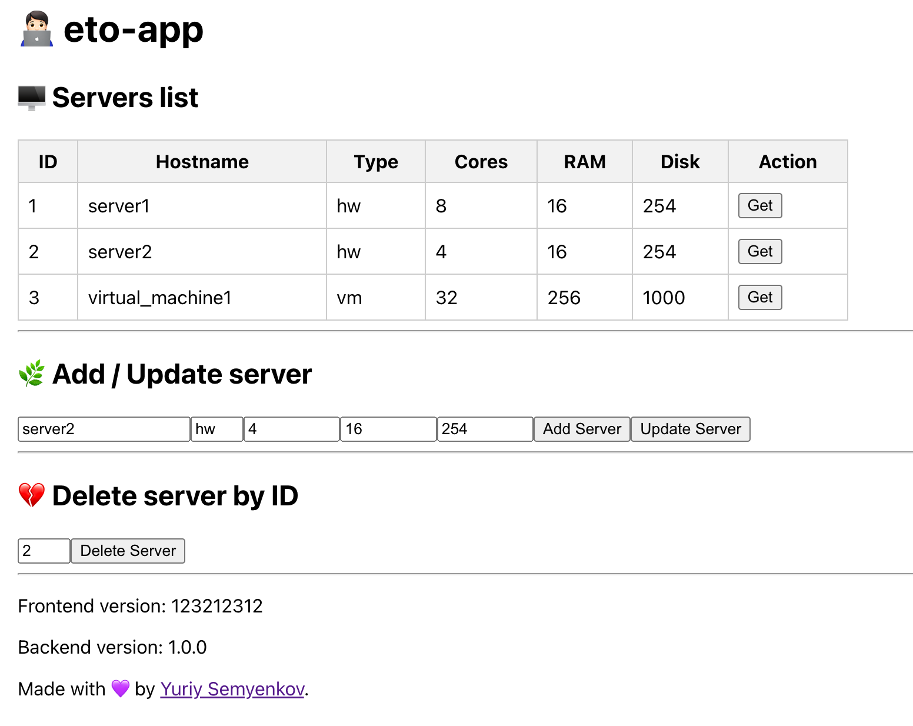

# eto-app


Simple application to train some programming and DevOps skills. It contains:
- Backend API (Python, FastAPI, SQLAlchemy, Pydantic)
- Frontend (NodeJS, React)
- Database (default - local SQLite file)

## Backend

Base API CRUD Python application, working with fastapi, sqlalchemy, pydantic.

By default works with SQLite file-based database stored in the container — all data will be deleted after restart.

You can set your own database connection in `backend/.env` file or with a `DB_CONN` variable (See `docker-compose.yml`).

You can find swagger at `/api/docs`. Main API enpoint is `/api/servers`

## How to run backend

### Local

Fill in the .env file:

```
mv .env.example .env
nano .env
```

```
cd backend
python3 -m pip install -r requirements.py
uvicorn app.main:app
```
#### Load example data

To load some predifined data from `dataset.csv` use:
```
python3 load.py
```

#### Backend Version

To set backend version which will appear at the very bottom of the frontend page, you should set `BACKEND_VERSION` environment variable, e.g. `BACKEND_VERSION=1.1.2`. This value will be in the response on `/api/version` API endpoint.

### Docker

Fill in the .env file in `backend` directory:

```
cd backend
mv .env.example .env
nano .env
```

Works as non-root user `worker`. You can build your own image:

```
cd backend
docker build -t eto-backend:latest .
docker run --env-file .env -p 8000:8000 eto-backend:latest
```

Or run my image from DockerHub:

```
docker run --env-file .env -p 8000:8000 etoosamoe/eto-backend:latest
```

### Example of usage

```
curl --request POST \
  --url http://127.0.0.1:8000/api/servers \
  --header 'Content-Type: application/json' \
  --header 'accept: application/json' \
  --data '{
  "hostname": "ci00",
  "type": "hw",
  "cores": 32,
  "ram": 64,
  "disk": 1100
}'
```

# Frontend

Frontend works with NodeJS and uses React. It makes requests to backend API to get some data about servers.


## How to run frontend

### Local

By default `REACT_APP_BACKEND_URL` is empty, which means frontend will use relative URLs.

If you want to run frontend without container (which includes Nginx and will redirect `/api` requests to backend), you must set `REACT_APP_BACKEND_URL` env variable, e.g.:

```
cd frontend
npm install
REACT_APP_BACKEND_URL=http://127.0.0.1:8000 npm start
```
Then go to http://127.0.0.1:3000.

To build static files:

```
cd frontend
npm ci
npm run build
```
Files will be in the `build` directory.

#### Frontend Version

To set frontend version which will appear at the very bottom of the page, you should set `REACT_APP_FRONT_VERSION` environment variable, e.g. `REACT_APP_FRONT_VERSION=1.1.1`.

### Docker

This is a multi-stage build, and final image contains only Nginx web-server, static files from build image, and Nginx configuration file (`frontend/nginx.conf`). Nginx also proxy-passes all requests to `/api/servers`, `/api/version`, `/api/docs` locations to backend instance. (See `frontend/Dockerfile`)

Fill in the .env file in `frontend` directory:

```
cd frontend
mv .env.example .env
nano .env
```
Then run build container image:

```
cd frontend
docker build -t eto-frontend:latest .
docker run --env-file .env -p 3000:3000 eto-frontend:latest
```

Or run my image from DockerHub:

```
docker run --env-file .env -p 3000:3000 etoosamoe/eto-frontend:latest
```

# How to run entire app
## Docker Compose

Fill in the .env file in `frontend` and `backend` directories:

```
mv .env.example .env
nano .env
```

> [!TIP]
> If you use ARM arch (e.g. mac m1 cpu), you should uncomment arch directive in `docker-compose.yml` file.

The run these commands from the root directory:

```
docker compose pull
docker compose up -d
or
docker compose up -d --no-build
```

## Kubernetes

Manifests in `k8s` directory includes:
- `db.yml` as Postgres deployment, with configmap
- `backend.yml` and `frontend.yml` to deploy application
- namespace creation

If you already have a database just fill in db and host to configmap (1 step), and fill in the user and password to `secrets.yml`. Then go straight to 4 step.

1. Fill in the configmap parameters in `k8s/db.yml` with database name and database host.
2. Add base64-encoded values of `postgres-user` and `postgres-password` to `secrets.yml`.
3. Deploy the database:
```
cd k8s
kubectl apply -f namespace.yml
kubectl apply -f db.yml
```
4. Deploy the application:
```
# If you need a database uncomment the line below
# kubectl apply -f db.yml
kubectl apply -f namespace.yml
kubectl apply -f backend.yml
kubectl apply -f frontend.yml
```

## Helm

WIP

# Monitoring

## Healthcheck
Backend has `/healthcheck` endpoint which returns status-code `200`.

## Sentry
You can add Sentry DSN as `SENTRY_DSN` env. variable, e.g. `SENTRY_DSN="https://<dsn>.ingest.sentry.io/<id>"`.

## Metrics
Prometheus-like metrics endpoint:
WIP

# Endpoints

`/flaky` — this API enpoint will raise an 500 error sometimes. Default probability is 0.1 which means 10% of all requests. It can be modified by `FLAKY_ERROR_PROBABILITY` env. variable. e.g. if probability=1 every request to /flaky endpoint will raise an error.